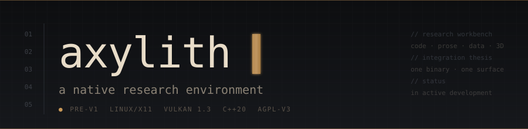
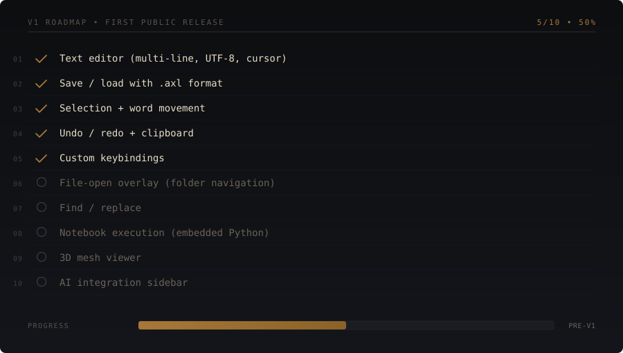
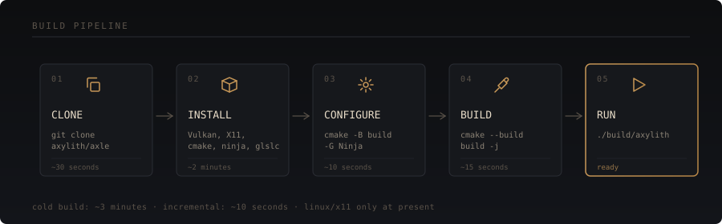

<p align="center">
  
</p>

<p align="center">
  <a href="https://docs.axylith.com"><b>Documentation</b></a>
  &nbsp;·&nbsp;
  <a href="docs/FORMAT.MD"><b>File Format</b></a>
  &nbsp;·&nbsp;
  <a href="changelog.md"><b>Roadmap</b></a>
  &nbsp;·&nbsp;
  <a href="manifesto.md"><b>Manifesto</b></a>
</p>

<p align="center">
  <a href="https://github.com/Axylith/axle/actions/workflows/build.yml"></a>
  <a href="https://github.com/Axylith/axle/actions/workflows/codeql.yml"></a>
  <a href="LICENSE"></a>
  <a href="https://isocpp.org/"></a>
</p>

---

## The idea

Axylith is one native binary where prose, code, data, and 3D geometry share state, with an integrated AI that can reason about all of them &mdash; not as separate tools talking through a clipboard, but as a single surface.

The current build is the substrate: a text editor with multi-line input, save/load to a custom file format, MTSDF text rendering through Vulkan 1.3, and a fully data-driven keybinding system.

The longer arc &mdash; document-as-program execution, mesh viewer with AI-driven geometric operations, integrated AI sidebar with structured reasoning &mdash; is in the [roadmap](changelog.md) and the [manifesto](manifesto.md). That product does not exist yet. This repository is the foundation being built first.

---

## V1 progress

<p align="center">
  
</p>

---

## Getting started

<p align="center">
  
</p>

Linux only at present. Tested on Ubuntu 24.04, Arch, and Fedora.

```bash
git clone https://github.com/Axylith/axle.git
cd axle
sudo apt install -y \
    build-essential cmake ninja-build \
    libvulkan-dev vulkan-validationlayers \
    libx11-dev libxext-dev \
    glslc
cmake -B build -G Ninja -DCMAKE_BUILD_TYPE=Release
cmake --build build -j
./build/axylith
```

For Arch and Fedora equivalents and a walkthrough of first save/load, see [docs/quickstart](docs/quickstart.mdx).

---

## What works today

<table>
<tr>
<td valign="top" width="50%">

**Editor**
- Multi-line text editor
- Full cursor movement (arrows, Home/End, vertical, word jumping)
- UTF-8 input via X11 input methods
- Save and load through 16-byte-headered `.axl` format
- Plain-text fallback for any non-AXL file

</td>
<td valign="top" width="50%">

**Input + editing**
- Configurable keybindings via `axylith.conf`
- Undo / redo with edit-kind coalescing (hybrid time + boundary)
- Internal clipboard (Ctrl+C / X / V)
- Word movement (Ctrl+arrows) and word deletion
- Select-all (Ctrl+A)

</td>
</tr>
<tr>
<td valign="top">

**Rendering**
- Vulkan 1.3 MTSDF text pipeline
- Resolution-independent text
- Sub-pixel accurate positioning
- On-screen HUD: measured frame time, keystroke-to-submit input latency

</td>
<td valign="top">

**Infrastructure**
- CI matrix: GCC 12, 13 &times; Clang 17 &times; Debug, Release, RelWithDebInfo
- Sanitizers: AddressSanitizer, UBSan, ThreadSanitizer
- CodeQL security analysis on PRs + weekly
- 79-assertion unit test suite for the editor model

</td>
</tr>
</table>

---

## What's on the roadmap

See [`roadmap.yml`](roadmap.yml) for the source of truth that drives the progress bar.

In rough build order: file-open overlay with folder navigation &middot; find / replace &middot; scroll viewport polish &middot; embedded Python interpreter for document-as-program execution &middot; mesh loading and viewport &middot; AI integration sidebar &middot; Wayland / macOS / Windows backends.

The full strategic plan is in the [changelog](changelog.md). The reasoning behind the project is in the [manifesto](manifesto.md).

---

## Tests

```bash
cd build
ctest --output-on-failure
```

Two test executables run in CTest: `axl_test` covers the on-disk format, `editor_test` covers the editor model (undo/redo, clipboard, selection, word movement, UTF-8 cursor handling). Sanitizers run in CI on every push. Valgrind Memcheck runs in CI for uninitialized-memory detection that ASan misses.

---

## Project constraints

These are choices about what kind of tool Axylith should be. They reflect tradeoffs, not universal correctness.

<table>
<tr><td><b>Single native binary</b></td><td>No bundled browser, no JavaScript runtime, no Electron. Smaller install footprint, lower memory baseline; the tradeoff is more work per platform.</td></tr>
<tr><td><b>Minimal external deps</b></td><td>Currently <code>stb_truetype.h</code> (header-only) plus system libraries. An embedded Python interpreter will be added with the notebook execution layer.</td></tr>
<tr><td><b>Local-first</b></td><td>Files on disk are the source of truth. No account required. Network features will be opt-in when they exist.</td></tr>
<tr><td><b>Readable file format</b></td><td><code>.axl</code> files are plain UTF-8 behind a small binary header. Inspectable with <code>cat</code> or <code>od</code>. No encryption or compression in V1.</td></tr>
<tr><td><b>Measured latency</b></td><td>Input latency and frame time are displayed in the HUD by code in this repository. The numbers are auditable, not asserted.</td></tr>
</table>

---

## File format

`.axl` is a 16-byte header followed by raw UTF-8 content. Files without the header are loaded as plain text. Full spec in [docs/FORMAT](docs/FORMAT.MD).

```
$ od -An -tx1 -N 16 untitled.axl
 41 58 4c 00  01 00  00 00  00 00 00 00 00 00 00 00
   A  X  L \0   v1     reserved (zeros)

$ tail -c +17 untitled.axl
hello world
```

A V2 structured format (`AXLE` magic, 32-byte header) is specified and unit-tested but not yet emitted by the editor. Readers will support both before writers switch.

---

## License

Axylith is licensed under the [GNU Affero General Public License v3](LICENSE). A commercial license is available for organizations that cannot comply with AGPL &mdash; contact `founders@axylith.com`.

The companion physics engine (when published) will use BSL-1.1 with a planned conversion to Apache-2.0. Full licensing rationale is in the [changelog](changelog.md).

---

## Contributing

This is a small project, currently maintained by one person. Contributions are welcome but the architecture is still in flux &mdash; opening an issue before significant work helps ensure it fits the direction.

Active development happens on the `development` branch; `main` tracks released versions. Before opening a pull request, please read [CONTRIBUTING](CONTRIBUTING.MD) and the [Code of Conduct](CODE_OF_CONDUCT.md).

---

## Acknowledgements

Built by [Dev Bhatt](https://devbhatt.dev). Uses font atlas data derived from [JetBrains Mono](https://www.jetbrains.com/lp/mono/) and the MTSDF baking technique described by Viktor Chlumsk&yacute;.

CI infrastructure: [GitHub Actions](https://github.com/features/actions), [GitLab CI](https://about.gitlab.com/), [CircleCI](https://circleci.com/). Static analysis: [SonarCloud](https://sonarcloud.io/), [DeepSource](https://deepsource.com/), [Snyk](https://snyk.io/), [CodeQL](https://codeql.github.com/).

<p align="center">
  <sub><sub>&middot;</sub></sub>
</p>