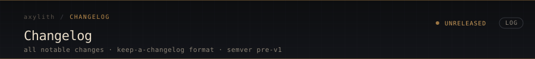

  

All notable changes to Axylith are documented here. Format based on [Keep a Changelog](https://keepachangelog.com/).

---

  

### Added
- **Command layer.** All key handling moved out of `main.cpp` into `src/platform/command.{h,cpp}`. The `KeyPress` handler in `main.cpp` is now a small dispatch into `command_handle_key()`, which owns the entire keybinding table.
- **Undo / redo with hybrid coalescing.** Edits within a 500ms window of the same kind (typing run, deletion run) collapse into one undo step. Paste and selection-delete are always their own step. 256-step bounded history. Bound to Ctrl+Z, Ctrl+Y, and Ctrl+Shift+Z.
- **Internal clipboard.** `editor_copy`, `editor_cut`, `editor_paste`. Ctrl+C / X / V. Paste replaces any active selection in one undo step. The X11 system clipboard bridge is deferred to a later step.
- **Select-all.** `editor_select_all` + Ctrl+A binding. Selection covers the entire buffer; cursor moves to end.
- **Source tree reorganized into subsystems.**
  - `src/core/` — `types.h`, `metrics.h`, `monitor.h`
  - `src/platform/` — `window.{cpp,h}`, `command.{cpp,h}`
  - `src/editor/` — `editor.{cpp,h}`
  - `src/render/` — atlas, font, pipeline, renderer, solid, swapchain, text, vulkan_init
  - `src/main.cpp` stays at the root
  - CMake configured so bare `#include "editor.h"` style continues to work
- **Editor unit test suite.** `tests/editor_test.cpp` runs 79 assertions covering UTF-8 cursor movement, line navigation, word movement, selection, undo coalescing (kind and time boundaries), paste-as-own-step, redo invalidation, and clipboard semantics. ~1 second wall time.
- **Docker-based CI.** `.github/docker/Dockerfile.ci` pre-bakes Ubuntu 24.04 with `gcc-12/13`, `clang-17`, `libclang-rt-17-dev` for sanitizer linking, `cmake`, `ninja-build`, `vulkan-dev`, `x11-dev`, `glslc`, `ccache`, `valgrind`. Image is built by `.github/workflows/docker-ci-image.yml` on Dockerfile changes and pushed to GHCR. `build.yml` and `release.yml` consume the image, eliminating per-job apt install overhead.
- **Valgrind Memcheck in CI.** Catches uninitialized-memory reads that AddressSanitizer misses. Runs on every push against `editor_test` and `axl_test`.
- **Release workflow rewrite.** Runs inside the Docker image, gates publication on tests passing, names artifacts with the version and platform (`axylith-vX.Y.Z-linux-x86_64`), computes SHA-256 checksums alongside the binary, and auto-marks pre-release for tags containing `-rc`, `-beta`, `-alpha`.
- **README visual overhaul.** Custom SVG header (`.github/assets/header.svg`), build pipeline diagram (`pipeline.svg`), auto-generated V1 progress badge (`v1-progress.svg`), and a small icon set (`icons.svg`) — all in a consistent warm-amber-on-dark editor aesthetic.
- **V1 progress badge.** `roadmap.yml` drives the badge content. `tools/generate_progress.py` regenerates the SVG. `.github/workflows/progress.yml` runs the script on `roadmap.yml` changes and auto-commits the updated badge with `[skip ci]`.
- **Keymap config file.** Editor reads `axylith.conf` from the working directory, or `$XDG_CONFIG_HOME/axylith/keys.conf` / `~/.config/axylith/keys.conf` if no local file is present. Bindings are line-based, comments with `#`, soft warnings on unparseable lines. Example at `axylith.conf.example`.

### Changed
- **`editor_record_edit`** now considers a hybrid time + edit-kind boundary: a new undo step starts on first edit, kind transition, paste, selection-delete, or 500ms idle. Previously coalesced only on kind transition.
- **Build matrix** updated to consume the pre-baked container; the per-job `apt-get install` step is gone. Total CI time roughly halved for cold runs and largely unchanged for warm runs (ccache already handled the warm case).
- **`.gitignore`** cleaned up. Build directories (`build/`, `cmake-build-*/`), IDE config (`.idea/`, `.vscode/`), runtime output (`axylith_resource.csv`), compiled shaders (`shaders/*.spv`), local data, and vendored third-party are all ignored.
- **CI workflow path filters** prevent doc-only changes from triggering the build matrix. README, changelog, and docs edits no longer spend CI minutes.

### Fixed
- **`Cmd::None` and `EditKind::None` renamed to `::Unbound` and `::Initial`** to avoid collision with X11's `#define None 0L` macro in `Xlib.h`.
- **`Page` struct size comment was wrong** — said "40 bytes," `static_assert` confirms 22. Comment corrected.
- **Sanitizer CI was failing** to link `libclang_rt.asan*` because the Clang runtime libraries weren't bundled with the `clang-17` package on Ubuntu 24.04. `libclang-rt-17-dev` added to the CI Docker image.
- **Old `ci.yml` referenced a missing `_setup.yml`** reusable workflow. The reference is gone; `build.yml` covers what `ci.yml` was supposed to.

### Notes
- `editor.cpp`'s undo/redo code uses full-buffer snapshots (`UndoState{std::string text, size_t cursor}`). This is fine for the 64 MB V1 cap but will be replaced when the buffer becomes a piece table.
- The 79-assertion editor test suite caught one real bug during development (a test assertion that misunderstood kind-coalescing semantics; the editor was correct, the test was wrong).
- Some of the visual SVG elements (the blinking cursor in the header, the gradient animations) use `<animate>` tags. GitHub's SVG renderer strips animation tags in many contexts; the visuals render statically on the GitHub home page even though they animate when viewed directly.

---

  

### Added
- Text editor core (`editor.h` / `editor.cpp`): UTF-8 buffer, cursor model,
  dirty/modified flags, status messages, input-latency instrumentation hooks
- Atomic save/load to the `.axl` v1 format (16-byte header + raw UTF-8),
  with plain-text fallback for any non-AXL file
- Cursor movement: left/right (UTF-8 codepoint aware), up/down (byte-column
  preserving), Home/End (line-relative)
- Multi-line text rendering: `append_text_run` composes runs without resetting
  glyph_count; `\n` advances the baseline by one line height
- `build_text_vertices_with_cursor` — records the cursor's screen position
  during layout so the cursor quad can be drawn at the correct offset
- Scrolling viewport: `Editor.scroll_y` pixel offset, `editor_scroll_to_cursor`
  (keeps cursor visible with a one-line margin), `editor_scroll_lines`
  (mouse-wheel / clamped), `editor_page_up` / `editor_page_down`
- Mouse-wheel scrolling via X11 Button4/Button5; PageUp/PageDown keybinds
- XIM/XIC input path for correct UTF-8 input (Shift, AltGr, dead keys, multibyte)
- On-screen HUD (`metrics.h`): EMA-smoothed frame time, keystroke-to-submit
  input latency, glyph count; F1 toggles visibility
- `exe_relative()` path resolution — shaders and assets load correctly from any
  working directory via `/proc/self/exe`
- Documentation set: `docs/FORMAT.md` (the `.axl` format spec, v0/v1/v2),
  `docs/API.md` (public C++ API across all subsystems), `docs/introduction.mdx`
  and `docs/quickstart.mdx` (Mintlify pages)

### Changed
- Editor mutation functions (`editor_insert_utf8`, `editor_backspace`,
  `editor_newline`) now operate at the cursor position rather than at the
  end of the buffer
- `editor_load` resets the cursor to 0 after replacing the buffer
- README rewritten — honest pre-V1 status section, tightened badge set,
  removed unverified claims and the decorative "Powered By" wall
- CI installs now bypass the unreliable Azure Ubuntu mirror and cap apt
  timeouts (prevents multi-minute hangs)

### Fixed
- `decode_delta` operator-precedence bug: the cast bound tighter than the
  shift, so every decoded timestamp collapsed to tier 0. Caught by the
  "Tier 1: hours" format test.
- `utf8_next` used `if` instead of `while`, so it only skipped one
  continuation byte — broke navigation over 3- and 4-byte codepoints
- Newline (0x0A) was rejected by the control-byte filter in
  `editor_insert_utf8`, so `editor_newline` silently inserted nothing
- `editor_save` used `memccpy` instead of `memcpy`, passing a pointer cast
  to `size_t` as the length
- `load_spirv` returned null for missing files, leading to a null shader
  module passed to Vulkan; now checks the SPIR-V magic and short reads
- Various build warnings: `#pragma pack(pop)` trailing semicolon, missing
  explicit casts in `types.h`, internal-linkage `static const char*` in a
  header

### Notes
- The format test suite is currently 22 tests (the count in earlier entries
  was from before the suite was trimmed and the decode bug was fixed)

---

  

### Added
- X11 window creation with WM_DELETE_WINDOW support
- Vulkan 1.3 initialization (instance, surface, device, swapchain)
- Dynamic rendering with vkCmdBeginRendering/vkCmdEndRendering
- Graphics pipeline with vertex + fragment shaders
- First colored quad rendering (Tol palette teal)
- Vertex buffer with GPU memory allocation
- Alpha blending in pipeline
- Threaded Vulkan initialization (window at 0.3ms)
- Resource monitoring (CPU/RAM CSV output)
- X connection error handling (clean shutdown on WM kill)
- .axl binary format: Block (12B), Page (22B), Project (10B), Header (32B)
- Tiered timestamp encoding (minutes/hours/days in 2 bytes)
- MTSDF text rendering pipeline with JetBrains Mono atlas
- CI/CD: GitLab CI + GitHub Actions + CircleCI
- Sanitizer builds (ASan + UBSan)
- Static analysis (clang-tidy)
- Dual compiler builds (GCC + Clang)
- SonarCloud integration
- AGPL v3 license
- CONTRIBUTING.md with CLA and mentorship program
- CODE_OF_CONDUCT.md with AI policy and three-strike system
- SECURITY.md
- GOVERNANCE.md
- FOUNDERS.md (template)
- funding.json and FUNDING.yml
- README.md with badges