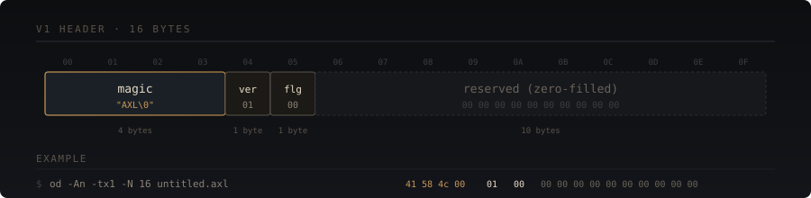
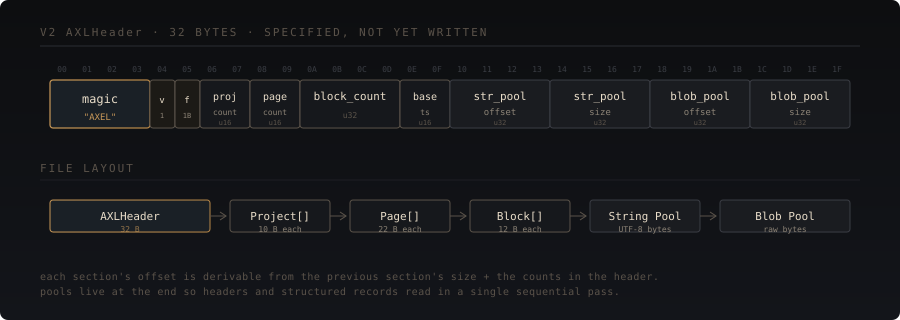
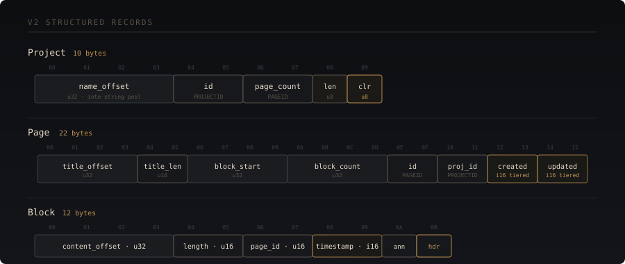
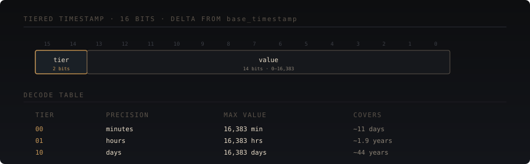

<p align="center">
  
</p>

> **Status.** V1 is implemented and used by the running editor. V2 (`AXEL` magic, 32-byte header, structured blocks, string pool, blob pool) is specified and unit-tested via `axl_test.cpp` but the editor does not emit V2 yet. Readers will support both before writers switch.

## Goals

The format is plain enough to read with `cat`, structured enough to support multi-page multi-block notebooks without rewrites, and small enough to keep memory and disk pressure reasonable on long-lived documents.

Specifically:

- **Inspectable.** Plain-text content is readable without tooling. Binary headers are inspectable with `od -tx1`.
- **Stable.** Header layouts are pinned with `static_assert` on `sizeof` at compile time; format-changing edits to structs fail the build.
- **Forward-compatible.** V1 readers ignore unknown trailing fields. V2 readers detect V1 files by magic and load them transparently.
- **Endianness.** All multi-byte integers are little-endian. Cross-platform readers must byte-swap on big-endian hosts.

---

## V1 — the current on-disk format

A 16-byte header followed by raw UTF-8 content. Used by the editor today.

<p align="center">
  
</p>

### Detection

A file with the first 4 bytes equal to `"AXL\0"` is V1. Files without this magic are loaded as plain text — same content path, no header skip. This is the fallback that lets the editor open any text file.

### Write semantics

The editor writes V1 atomically:

1. Write header + content to `<path>.tmp`.
2. `fsync(fd)` to flush data to disk.
3. `close(fd)`.
4. `rename(<path>.tmp, <path>)` — POSIX `rename` is atomic; readers either see the old file or the new one, never partial content.

If any step fails the temp file is unlinked and the original is untouched. The status line displays the underlying `errno` string.

---

## V2 — structured notebook format

V2 extends the format from "single-stream document" to "multi-page, multi-block notebook." V2 files use the magic `"AXEL"` to distinguish from V1's `"AXL\0"`. The full layout is defined as C++ structs in `src/core/types.h` and verified at compile time.

<p align="center">
  
</p>

The C++ definition:

```cpp
struct AXLHeader {
    uint8_t  magic[4];           // "AXEL"
    uint8_t  version;            // format major version
    uint8_t  flags;              // reserved bit flags
    uint16_t project_count;      // matches PROJECTID range
    uint16_t page_count;         // matches PAGEID range
    uint32_t block_count;        // total blocks across all pages
    uint16_t base_timestamp;     // days since Unix epoch (through ~2149)
    uint32_t string_pool_offset; // byte offset of string pool from file start
    uint32_t string_pool_size;
    uint32_t blob_pool_offset;
    uint32_t blob_pool_size;
};
static_assert(sizeof(AXLHeader) == 32);
```

### Structured records

<p align="center">
  
</p>

**Project** (10 bytes) — top-level grouping of pages. `color` is a palette index, not packed RGBA; the palette ships with the binary. This keeps document files stable when palette tweaks ship.

**Page** (22 bytes) — a single document within a project. References blocks by index into the `Block[]` table.

**Block** (12 bytes) — atomic unit of content. The 1-byte `BlockHeader` packs three fields:

```cpp
struct BlockHeader {
    uint8_t kind:    2;  // 0=text, 1=compute, 2=embed, 3=reserved
    uint8_t subkind: 3;  // 0-7, interpretation depends on kind
    uint8_t flags:   3;  // 3 boolean flags
};
```

Block kind determines which pool `content_offset` references:

| kind      | meaning              | content lives in |
|-----------|----------------------|------------------|
| `text`    | prose                | string pool      |
| `compute` | executable code      | string pool      |
| `embed`   | image, mesh, dataset | blob pool        |

### Tiered timestamp encoding

Notebook records use 2-byte `int16_t` deltas from a single `base_timestamp` in the file header. The top 2 bits encode precision; the bottom 14 encode value:

<p align="center">
  
</p>

This means recent edits get minute-precision and old documents still encode meaningful timestamps without inflating to 4- or 8-byte fields. `encode_delta()` and `decode_delta()` in `types.h` handle the conversion; `reconstruct_time()` returns a Unix timestamp by adding the decoded delta to the file's `base_timestamp`.

### Pools

Both pools are byte arrays referenced by `(offset, length)`:

- **String pool.** UTF-8 strings, not null-terminated. Names, titles, prose. Strings may be deduplicated (writer's choice; readers don't depend on it).
- **Blob pool.** Raw bytes. Image data, mesh data, embedded files. Format of each blob is identified by the owning block's `subkind`.

Pools live at the end of the file so headers and structured records can be read in a single sequential read.

---

## Atomicity and crash safety

All writes use the `tmp → fsync → close → rename` sequence. V2 will additionally:

- Write structured records and pools to the temp file in a single pass.
- Refuse to overwrite a corrupted V2 file without explicit user confirmation.
- Keep one rolling backup (`<path>.bak`) of the previous version. Toggle via flags bit `0x01`.

---

## Limits

| Limit                  | V1     | V2                |
|------------------------|--------|-------------------|
| Single file size       | 64 MB  | 4 GB (file offsets are `uint32_t`) |
| Projects per file      | —      | 65,535 (`PROJECTID`) |
| Pages per file         | —      | 65,535 (`PAGEID`)    |
| Blocks per file        | —      | 4,294,967,295 (`block_count`) |
| String pool            | —      | 4 GB              |
| Blob pool              | —      | 4 GB              |
| Block content per item | —      | 65,535 bytes      |
| Date range             | —      | base + ~44 years  |

The V1 64 MB cap is enforced by the loader and exists because the entire document is loaded into a single `std::string`. The cap will lift when the editor adopts a piece-table or chunked storage internally.

---

## Compatibility matrix

| Reader \ Writer | V1 file | V2 file | Plain text |
|-----------------|---------|---------|------------|
| V1 editor       | yes     | no      | yes        |
| V2 editor       | yes     | yes     | yes        |

V1 → V2 migration: V2 readers detect V1 magic and emit a single text block on a single page in a single project. No data loss; the V2 file written back will have the structured form.

V2 → V1 downgrade is not supported. Once a file has multi-page or multi-block content, V1 has no way to represent it.

---

## Testing

`tests/axl_test.cpp` verifies the header layout and round-trips a V1 file. `tests/editor_test.cpp` covers the editor model that produces the document body. Both run in CI on every push across GCC 12, GCC 13, and Clang 17, in Debug, Release, and RelWithDebInfo configurations, with AddressSanitizer, UndefinedBehaviorSanitizer, ThreadSanitizer, and Valgrind Memcheck builds.

When V2 writers land, additional tests will cover: structured record round-trips, pool integrity under fuzzing, and migration from V1 documents.